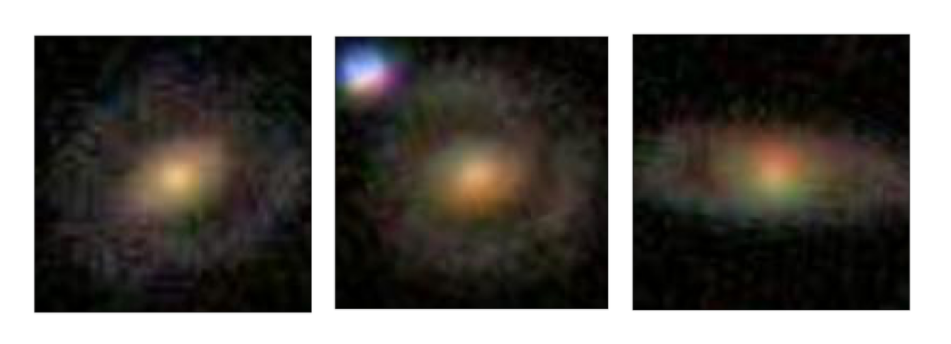

# Galaxy Classification with Convolutional Neural Networks

In this project, I employ Convolutional Neural Networks (CNNs) to classify galaxies based on image data from the Galaxy Zoo dataset, a crowd-sourced initiative devoted to annotating galaxies for scientific discovery. Telescopic observations yield millions of celestial images, yet their scientific utility is hindered by the lack of annotations. My focus is on categorizing galaxies into four classes:

<table>
  <tr>
    <td style="text-align:center;"><b>[1,0,0,0] - Galaxies with no identifying characteristics</b> </td>
    <td style="text-align:center;"><b>[0,1,0,0] - Galaxies with rings</b> </td>
  </tr>
  <tr>
    <td style="text-align:center;"><b>[0,0,1,0] - Galactic mergers</b> </td>
    <td style="text-align:center;"><b>[0,0,0,1] - “Other,” Irregular celestial bodies</b> </td>
  </tr>
</table>

**Neural Architecture**

The neural model comprises convolutional layers, employing ReLU activation and max-pooling for spatial feature extraction. The architecture includes flattening, dense layers with ReLU activation, and an output layer with softmax activation for classification.

**Model Configuration**

The model is configured with the Adam optimizer, categorical crossentropy loss (due to one-hot encoding of labels), and metrics like categorical accuracy and AUC. Training involves learning from annotated data to predict galaxy classes.

**Performance Metrics**

The model achieves accuracy scores surpassing 70%, outperforming random baseline models by approx. 45%. The AUC metric, exceeding 80%, emphasizes the model's ability to discern true classes from false ones.

**Visualization**

Visualizing CNN activations provides insights into the features influencing the model's classification of deep-space galaxies.